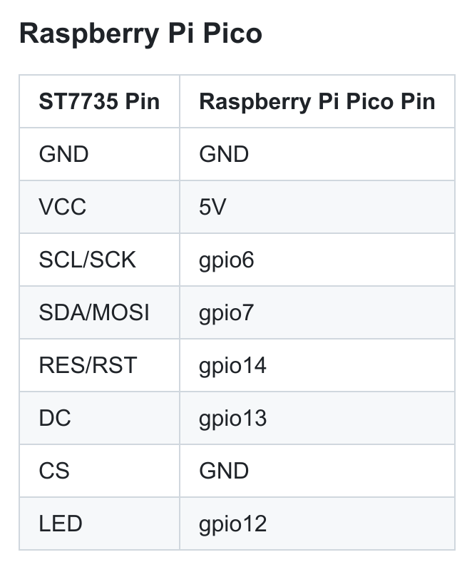

## Pico pins


## LCD Display connection 




## Debug with second Pico

### Preinstall

```bash
rustup target add thumbv6m-none-eabi
cargo install flip-link
cargo install probe-rs --features cli
```

Add this firmware to the debug Pico through the UF2 bootloader:

https://github.com/raspberrypi/debugprobe

Then get address of the debug Pico:

```bash
lsusb
```
return something like this:

```bash
Bus 001 Device 005: ID 2e8a:000c Raspberry Pi Picoprobe CMSIS-DAP
```

You’ll also need to know what group the probe is owned by for the udev rule, so for that run

`grep 'uucp\|dialout' /etc/group`
It will output a line cotaining either uucp or dialout. Write down which one of the two it is. If both come up, pick one. And if nothing copes up, you’ll have to create the group uucp with

`sudo groupadd uucp`
Before adding yourself to the group, you can check if you’re already in it, so you can skip the step. Check with

`groups`
If you’re not in the group, you can add yourself with

`sudo usermod -a -G GROUP_NAME YOUR_USERNAME`

then reboot the system or logout and log back in.

And now, to finally create the udev rule. You can either dowload the official multi-purpose probe-rs rule file or create your own.

If you dowloaded the rule file, move it to the following directory. If you wish to make your own, you’ll need to create a file on the following directory:


`/etc/udev/rules.d/`

A udev rules file name should be formatted the following way:

[priority]-[name].rules

[priority] has to be a two digit number, from 01 to 99. Make sure it’s lower than 73 though, otherwise it can cause issues.
[name] is the name you want to give the file so it is easily identifiable.
With this in mind, I will name the file 50-pico.rules, but if for any reason a file with that exact name already exists, you can change it up a little
The file has to contain the following:

`ATTRS{idVendor}=="AAAA", ATTRS{idProduct}=="BBBB", MODE="664", GROUP="YOUR_GROUP"`
Remember to open it as root, otherwise you won’t be able to save. You replace AAAA with the first part of the code you got when running lsusb and BBBB with the second. You’ll also have to change YOUR_GROUP to uucp or dialout depending on what you got earlier.

You can apply the rule changes with the following command:

`sudo udevadm control --reload-rules; sudo udevadm trigger`

[more about](https://slushee.dev/pico-tutorial/getting-started/)


Orange
TX/SC (swclk) (Output from Probe)

Black
GND

Yellow
RX/SD (swdio)(Input to Probe or I/O) 